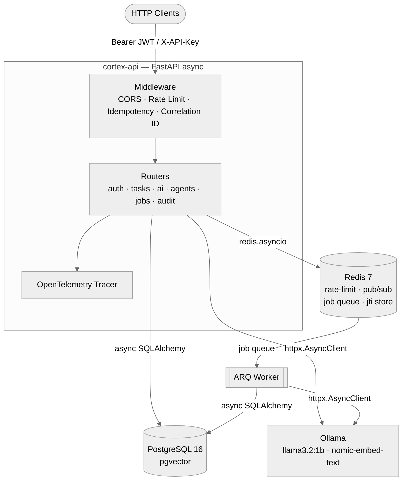
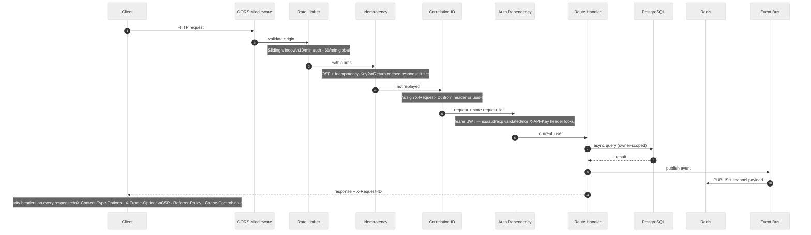
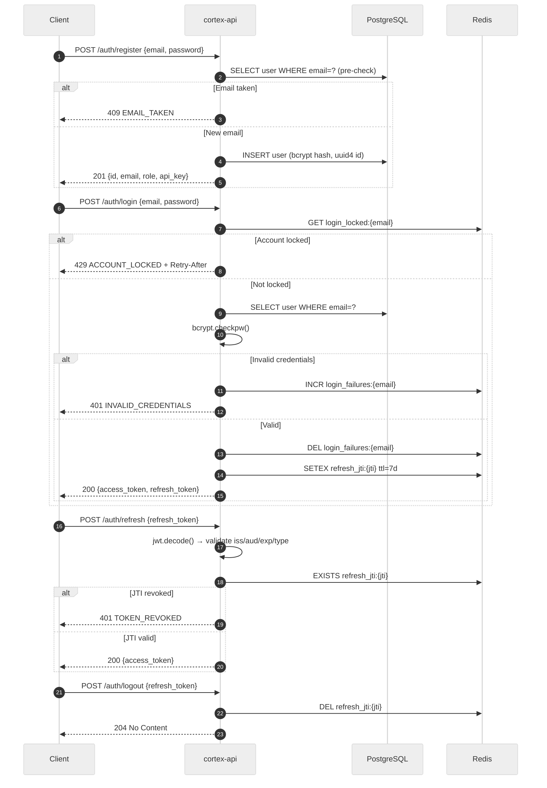
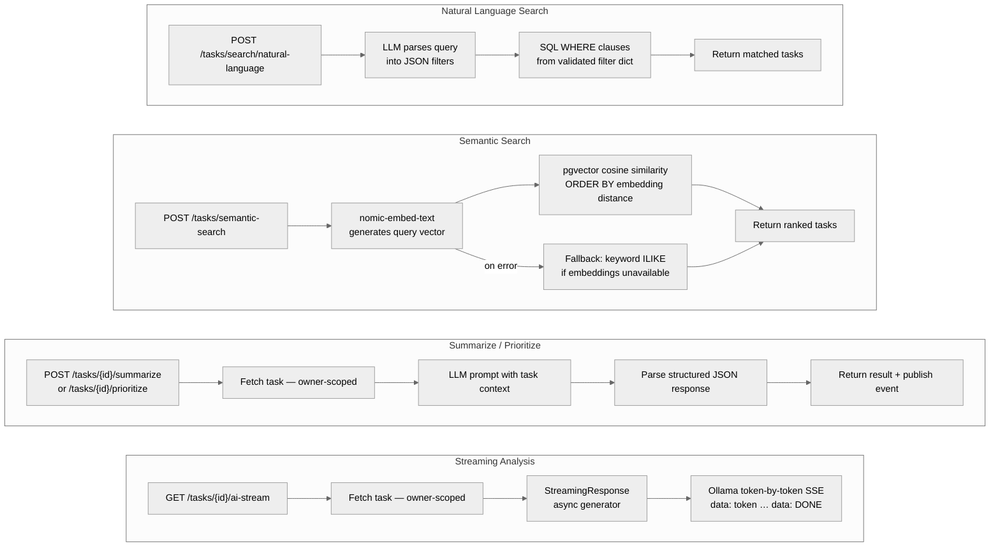
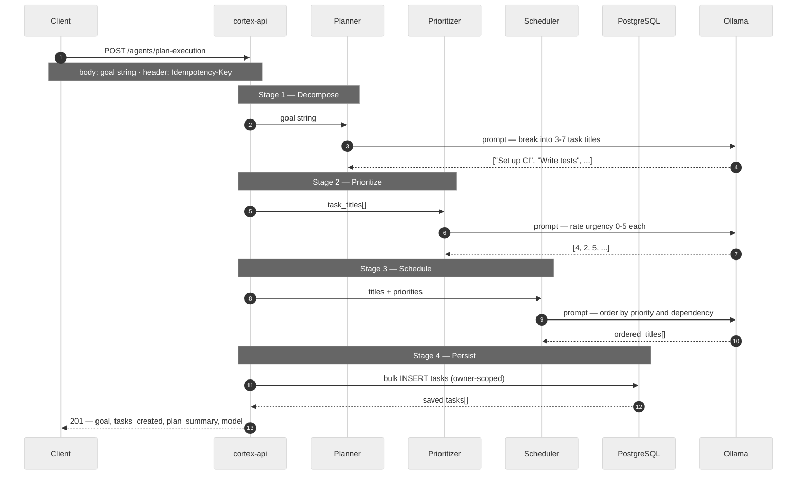
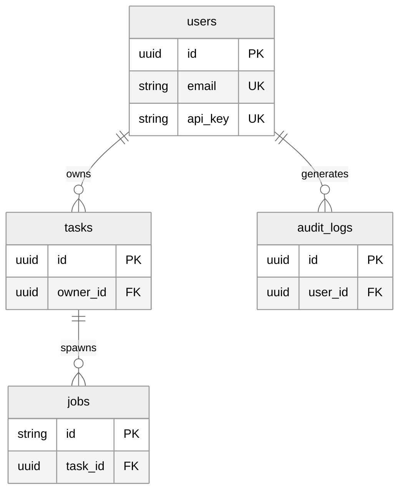
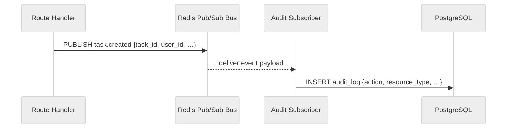

# cortex-api

[](https://github.com/adwibha/cortex-api/actions/workflows/ci.yml)


**An AI workflow platform built with FastAPI.** Demonstrates production-grade backend architecture: async I/O throughout, JWT auth with refresh-token revocation and RBAC, per-path rate limiting with account lockout, Redis pub/sub event bus, LangGraph-style agent orchestration, pgvector semantic search, idempotency keys, background job processing, OpenTelemetry tracing, and Prometheus metrics — all running free and locally via Docker Compose.

Every design decision in this codebase reflects a specific production concern: security, reliability, observability, or cost. This document explains the *what*, the *why*, and the *how* of each subsystem from first principles.

---

## Table of Contents

1. [Architecture Overview](#architecture-overview)
2. [Stack](#stack)
3. [Request Lifecycle](#request-lifecycle)
4. [Security Model](#security-model)
5. [Auth Flow](#auth-flow)
6. [AI Workflow Lifecycle](#ai-workflow-lifecycle)
7. [Agent Pipeline](#agent-pipeline)
8. [Database Schema](#database-schema)
9. [Event Architecture](#event-architecture)
10. [Local Development](#local-development)
11. [API Reference](#api-reference)
12. [Idempotency Keys](#idempotency-keys)
13. [Streaming](#streaming)
14. [Observability](#observability)
15. [Running Tests](#running-tests)
16. [Project Structure](#project-structure)

---

## Architecture Overview



cortex-api is a single FastAPI process backed by three external dependencies — PostgreSQL, Redis, and Ollama — each chosen to serve multiple roles simultaneously, minimising the total surface area of the stack.

**PostgreSQL** is the source of truth for all durable data. It stores users, tasks, jobs, and audit logs in normalised relational tables, and also handles vector similarity search through the `pgvector` extension. Using one database for both relational queries and vector search eliminates the operational overhead of a separate vector store (such as Qdrant or Pinecone) while keeping all data access within a single transaction boundary.

**Redis** serves five distinct roles without adding a second infrastructure dependency: sliding-window rate limiting, idempotency-key response caching, pub/sub event dispatch, refresh-token JTI revocation, and ARQ background job queuing. Each role uses a different Redis data structure — sorted sets, strings, pub/sub channels, string keys, and lists — but they share the same connection pool and the same operational runbook.

**Ollama** runs inside the Docker Compose network. All LLM inference — text generation, embedding, and streaming — happens locally with no external API calls, no per-token cost, and no data leaving the machine. The trade-off is model quality: `llama3.2:1b` is a small model. But the architecture is identical to a production deployment against a frontier model; swapping to GPT-4o or Claude is a two-environment-variable change (`OLLAMA_URL`, `OLLAMA_MODEL`).

**ARQ** is an async task queue built on Redis lists. The HTTP process enqueues a job ID and returns `202 Accepted` immediately; the worker process picks up the job and calls Ollama asynchronously. This decouples slow AI operations (categorisation, embedding reindex) from the HTTP request/response cycle entirely.

---

## Stack

| Component | Technology |
|-----------|-----------|
| Web framework | FastAPI (async) |
| Database | PostgreSQL 16 + pgvector |
| ORM / Migrations | SQLAlchemy 2.0 (async) + Alembic |
| Caching / Queue | Redis 7 |
| Background jobs | ARQ |
| LLM inference | Ollama (llama3.2:1b, nomic-embed-text) |
| Auth | JWT HS256 + bcrypt (rounds=12) + API keys |
| Token revocation | Redis JTI store (per-token logout) |
| Tracing | OpenTelemetry (FastAPI + SQLAlchemy + Redis) |
| Metrics | Prometheus (prometheus-fastapi-instrumentator) |
| Config | pydantic-settings (typed, env-file, fail-fast) |
| Containerisation | Docker Compose (non-root user, health checks, resource limits) |
| CI | GitHub Actions (pytest + ruff) |

**FastAPI** was chosen over Flask or Django REST Framework for three specific reasons: it is async-native (no sync database wrappers needed), it generates a complete OpenAPI schema automatically from Python type annotations (no separate documentation step), and Pydantic validation runs at the request boundary before any business logic executes — meaning invalid input is rejected before a database connection is even acquired.

**SQLAlchemy 2.0 async** replaces the synchronous ORM pattern that would block the event loop on every query. With `async_sessionmaker` and `AsyncSession`, all queries use `await` and the event loop is never stalled waiting for I/O. This matters most under load: a synchronous ORM serialises concurrent requests through a thread pool; an async ORM multiplexes them on a single thread.

**Alembic** manages schema migrations as versioned Python files checked into the repository. The database schema is reviewable in pull requests, auditable in `git log`, and reproducible from any historical state with `alembic upgrade head`. The alternative — `Base.metadata.create_all()` on startup — works for development but silently diverges from production over time.

**pydantic-settings** centralises all configuration in a typed `Settings` class. Environment variables are read once at startup, validated against their declared types, and fail loudly with a descriptive error if a required value is missing or invalid. There are no scattered `os.getenv()` calls across the codebase, and no configuration error silently becomes `None` at runtime.

---

## Request Lifecycle

Every request passes through a deterministic middleware stack before reaching a route handler. The layers are not arbitrary — each sits exactly where it must to be effective.



**CORS** is outermost because browser preflight (`OPTIONS`) requests must be answered before any other processing occurs. If CORS sat inside the rate limiter, every preflight would consume a rate-limit slot even though it carries no credentials and performs no mutation.

**Rate limiting** runs immediately after CORS because it is the cheapest gate — a Redis pipeline of two commands — and it protects everything downstream, including the database, from being reached during a flood. Auth endpoints receive a tighter limit (10 req/min per IP) than general endpoints (60 req/min) because credential stuffing and brute-force attacks specifically target `/login` and `/register`. The limit is checked before the password hash comparison to avoid bcrypt CPU cost during an attack.

**Idempotency** intercepts POST requests before the route handler. If the `Idempotency-Key` header matches a cached response, that response is returned immediately and the entire remaining stack is bypassed — no database query, no LLM call, no event publication. The response is served from Redis in a single round-trip.

**Correlation ID** assigns an `X-Request-ID` to every request that does not already carry one. This ID is attached to `request.state`, written to every log line the handler produces, and included in every response header and error body. When a client reports an error, the request ID is sufficient to reconstruct the full trace of what happened on the server side.

**Auth** runs as a FastAPI dependency rather than a middleware because it is route-specific. Public routes (`/health`, `/docs`) carry no `get_current_user` dependency at all. Protected routes declare it explicitly in their function signature. Unauthenticated access to a protected route fails at dependency resolution — before any route logic executes.

All responses, regardless of route, receive a fixed set of **security headers**: `X-Content-Type-Options: nosniff`, `X-Frame-Options: DENY`, `Content-Security-Policy: default-src 'none'`, `Referrer-Policy: strict-origin-when-cross-origin`, and `Cache-Control: no-store`. These are applied in the correlation-ID middleware rather than per-route to ensure no response ever escapes without them.

---

## Security Model

| Mechanism | Details |
|-----------|---------|
| JWT access token | 30 min TTL · HS256 · `iss` + `aud` claims validated |
| JWT refresh token | 7 day TTL · `jti` stored in Redis · revocable via `POST /auth/logout` |
| bcrypt | 12 rounds (OWASP minimum guidance) |
| API key | 48-byte `urlsafe` token per user · `X-API-Key` header · stored hashed in DB |
| RBAC | `user` (default) and `admin` roles · enforced via `require_role` dependency |
| Rate limiting — auth | **10 req/min per IP** on `/auth/login`, `/auth/register`, `/auth/refresh` |
| Rate limiting — global | 60 req/min per IP on all other routes · sliding window via Redis |
| Account lockout | 5 consecutive login failures → 30-min lock per email (Redis-backed) |
| Idempotency | POST responses cached 24 h by `Idempotency-Key` header |
| Task isolation | All queries scoped to `owner_id` (UUID) — cross-user access returns 404 |
| UUID resource IDs | All public IDs are UUIDs — prevents count enumeration and ID guessing |
| Security headers | `X-Content-Type-Options`, `X-Frame-Options`, `CSP`, `Referrer-Policy`, `Cache-Control: no-store` on every response |
| Metrics endpoint | Protected by `Authorization: Bearer <METRICS_TOKEN>` when env var is set |
| Health deep endpoint | Exception messages sanitised — raw connection strings never exposed to clients |
| Secrets | All credentials injected via environment variables — no plaintext secrets in committed files |

The security design follows a **defence-in-depth** philosophy: no single mechanism is the sole protection for any attack surface. Several decisions are worth explaining in detail.

**Dual-token authentication** separates two concerns: *identity assertion* and *session management*. The access token is short-lived (30 minutes) and stateless — the server validates it by verifying the JWT signature and claims (`iss`, `aud`, `exp`, `type`) with no database query. The refresh token is long-lived (7 days) but stateful: its `jti` (JWT ID) is stored in Redis at issuance. Logout deletes the JTI from Redis; any subsequent refresh attempt is rejected even though the JWT signature and expiry are still technically valid. This achieves effective logout without adding a Redis lookup to every access-token validation.

**Account lockout works alongside IP-based rate limiting, not instead of it.** IP rate limiting throttles by client address, which can be bypassed with IP rotation. Account lockout throttles by email address, which cannot be bypassed without first enumerating valid accounts. After five consecutive failures for a given email, all further attempts for that email return `429 ACCOUNT_LOCKED` for 30 minutes, regardless of IP.

**UUIDs as public resource identifiers** prevent two information-disclosure attacks simultaneously: sequential integer IDs reveal the approximate total count of records, and their ordering reveals insertion sequence. A UUID reveals neither. UUID generation happens in application code before the `INSERT`, so the ID is available for event payloads and `Location` headers without a database round-trip to retrieve the generated value.

**Generic error messages on registration** mean the API returns the same response body whether an email is already registered or the request is otherwise malformed. An attacker cannot use the registration endpoint to enumerate which email addresses have accounts in the system.

---

## Auth Flow



**Registration** performs a pre-check `SELECT` before the `INSERT`. This is not the only guard: the `INSERT` also catches `IntegrityError` (a duplicate unique constraint violation) in case two concurrent registrations both pass the pre-check within the same millisecond. The pre-check exists for performance: it gives a fast, specific early error on the common path without relying on exception handling as the primary control flow.

**Login** follows the sequence: check lockout → query user → verify password → clear failures → issue tokens. The lockout check happens *before* the database query so that a brute-force attack targeting a locked account does not load the database at all — it is rejected in Redis first. Password verification uses `bcrypt.checkpw`, which is timing-safe: the comparison takes the same wall-clock time whether the password is correct or not, preventing timing-based inference of valid usernames.

**Token refresh** validates three things independently: the JWT signature and claims (`iss`, `aud`, `exp`), the token type field (`"refresh"` not `"access"`), and the presence of the `jti` in Redis. All three must pass. A stolen but expired token is rejected by claim validation. A stolen but logged-out token is rejected by the JTI check. A valid access token presented as a refresh token is rejected by the type check.

**Logout** deletes the refresh token's `jti` from Redis. The outstanding access token is *not* explicitly revoked — it will expire naturally within 30 minutes. This is an accepted trade-off: revoking access tokens immediately would require a Redis lookup on every request, eliminating the stateless advantage of JWTs. For most threat models, a 30-minute natural expiry after logout is acceptable.

---

## AI Workflow Lifecycle

The four AI capabilities in cortex-api deliberately use different integration patterns to demonstrate the range of approaches available when embedding an LLM in a backend system.



**Natural language search** uses the LLM as a *parser*, not a reasoner. The prompt instructs the model to convert free-text input into a strictly defined JSON filter object (`{ "completed": false, "priority_gte": 3 }`). SQL is then constructed *deterministically* from that validated filter using SQLAlchemy's query builder. The LLM never touches the database directly and cannot influence query structure — only filter values — making SQL injection structurally impossible regardless of what the model produces.

**Semantic search** uses the `nomic-embed-text` embedding model to convert a query string into a high-dimensional float vector, then queries PostgreSQL using pgvector's `<=>` cosine distance operator to find tasks whose stored embeddings are geometrically nearest to the query vector. This retrieves results that are *conceptually similar* even when they share no keywords — "fix the deployment pipeline" finds a task titled "CI/CD reliability improvements". A keyword-ILIKE fallback ensures the endpoint always returns something even when the embedding model is unavailable, making the degraded path explicit and testable rather than silent.

**Summarize and Prioritize** use the LLM as a *classifier and analyst*. The prompt includes the task's full context (title, description, priority, completion status) and requests structured JSON back — either a prose summary or a numeric priority with reasoning. The response is processed by a dedicated `extract_json_object` parser that handles the common case of models wrapping their output in markdown code fences before the actual JSON. If parsing fails, safe defaults are returned rather than an error, because an LLM's inability to produce clean JSON should not be a 500.

**Streaming analysis** uses FastAPI's `StreamingResponse` with an async generator that forwards tokens from Ollama's streaming API as Server-Sent Events. Tokens arrive one at a time over a persistent HTTP connection and are sent to the client as `data: {"token": "..."}` lines with a `data: [DONE]` sentinel at the end. SSE was chosen over WebSockets because the communication is strictly unidirectional (server to client) and SSE works natively over HTTP/1.1 with no protocol upgrade negotiation, making it simpler to proxy and load-balance.

---

## Agent Pipeline

`POST /agents/plan-execution` runs a four-stage pipeline where each stage calls the local LLM. The pattern mirrors production agent frameworks (LangGraph, AutoGPT) but without a framework dependency, keeping the control flow explicit and transparent.



Each stage is a pure async function with a single well-defined input and output contract, modelling the *single-responsibility principle* at the pipeline level.

**Stage 1 — Planner** performs goal decomposition. The LLM is prompted to return a JSON array of 3–7 concrete, actionable task title strings. If the model returns malformed output, the original goal string is used as a single task. Graceful degradation is preferable to a 500: a slightly imperfect task list is more useful to the user than no list at all.

**Stage 2 — Prioritizer** scores each task on urgency (0–5). The full task list is submitted in a single prompt so the model can reason about relative priorities rather than scoring each task in isolation. The output is a JSON array of integers aligned by index with the task titles array.

**Stage 3 — Scheduler** orders the tasks by descending priority. This stage is a pure Python `sorted()` call — no LLM call — because sorting by a numeric score is deterministic and needs no language reasoning. The LLM was used to produce the scores; sorting is the application's responsibility.

**Stage 4 — Persist** bulk-inserts the ordered tasks into PostgreSQL, all owned by the authenticated user via `owner_id`. If the original `POST /agents/plan-execution` request carried an `Idempotency-Key` header, retrying the request returns the already-cached task list from Redis without re-running any LLM calls — making the entire three-LLM pipeline safely retryable at zero additional cost.

---

## Database Schema



Three schema decisions are worth explaining.

**UUIDs as primary keys** on all tables prevent sequential enumeration of records. A client that knows task ID `550e8400-e29b-41d4-a716-446655440000` cannot guess the next task's ID because there is no incrementing counter. UUID generation happens in application code (Python's `uuid.uuid4()`) before the `INSERT`, which means the ID is available immediately for event payloads and `Location` response headers without a round-trip to retrieve a database-generated value.

**Cascade delete policy** flows from users → tasks → jobs: deleting a user removes their tasks; deleting a task removes its associated jobs. This is the correct policy for owned resources where the child has no meaning without the parent. Audit logs use `ON DELETE SET NULL` instead — the audit trail is preserved even after the referenced user is deleted, because an audit log's value is as a historical record of actions that *occurred*, not as a live foreign key.

**Separation of audit logs** from application tables enforces a structural constraint: application data and operational metadata are written by different code paths for different reasons. Route handlers write application data to `tasks`, `users`, `jobs`. Event subscribers write audit entries to `audit_logs`. The audit table is effectively append-only — there is no API endpoint to update or delete audit log rows, making it a reliable compliance and debugging record.

---

## Event Architecture

All mutations publish to a Redis pub/sub bus. Subscribers are decoupled — adding notifications, webhooks, or metric counters requires zero changes to route handlers.



| Event | Published by | Subscriber(s) |
|-------|-------------|---------------|
| `task.created` | `POST /tasks`, `POST /agents/plan-execution` | Audit log |
| `task.updated` | `PATCH /tasks/{id}` | Audit log |
| `task.completed` | `PATCH /tasks/{id}` (when `completed=true`) | Audit log |
| `task.deleted` | `DELETE /tasks/{id}` | Audit log |
| `job.finished` | ARQ worker | Audit log |
| `ai.summary_generated` | `POST /tasks/{id}/summarize` | Audit log |

The event bus is implemented as a thin wrapper around Redis pub/sub. When a route handler calls `publish(EventType.TASK_CREATED, payload)`, the payload is serialised to JSON and posted to a Redis channel. A background `asyncio` task — started during app lifespan — listens on all registered channels and dispatches incoming messages to the matching handler functions registered with the `@subscribe` decorator.

The key architectural benefit is **decoupling by design**: route handlers are completely unaware of what happens after they publish an event. Today, every event is handled by the audit log subscriber. Adding a second subscriber — a push notification, a webhook, a metrics counter — requires zero changes to route handlers; the new subscriber registers itself with `@subscribe(EventType.X)` and begins receiving events automatically.

There is one deliberate trade-off: Redis pub/sub is fire-and-forget. If the Redis connection drops after PUBLISH but before the message is delivered, the event is lost and no retry occurs. For audit logging this is acceptable — a missing audit entry is preferable to blocking the HTTP response waiting for guaranteed delivery. For billing events or financial transactions, a durable message queue (Kafka, RabbitMQ, SQS) would be required. The current architecture is designed to make that substitution straightforward: only `bus.py` would change.

---

## Local Development

### Requirements

- Docker + Docker Compose (nothing else needed for the full stack)
- Python 3.12+ (only for the no-Docker path)

### First-time setup

```bash
git clone https://github.com/adwibha/cortex-api
cd cortex-api

# Copy the example env and fill in required secrets
cp .env.example .env
# Edit .env — at minimum set POSTGRES_PASSWORD, REDIS_PASSWORD, JWT_SECRET
# Generate strong values with: openssl rand -hex 32
```

### Start everything

```bash
docker compose up --build
```

| Service | URL |
|---------|-----|
| API | http://localhost:8000 |
| Swagger UI | http://localhost:8000/docs |
| ReDoc | http://localhost:8000/redoc |
| Health | http://localhost:8000/health |
| Metrics | http://localhost:8000/metrics *(requires `METRICS_TOKEN` if set)* |

> **First startup** pulls two Ollama models (~1 GB total). Subsequent starts are instant because models are cached in a named volume.

### Tear down

```bash
docker compose down -v   # removes containers + volumes
```

### Run without Docker

```bash
cp .env.example .env
# Edit .env with your local Postgres and Redis connection strings

pip install -r requirements.txt
alembic upgrade head
uvicorn app.main:app --reload

# In a second terminal (optional — needed for /categorize jobs):
python worker.py
```

---

## API Reference

Replace `<token>` with the `access_token` from `POST /auth/login`.  
Task and user IDs are UUIDs — copy them from the response of the resource-creation call.

### Auth

```bash
# Register a new account
curl -s -X POST http://localhost:8000/api/v1/auth/register \
  -H "Content-Type: application/json" \
  -d '{"email": "you@example.com", "password": "yourpassword"}'

# Login → receive access_token + refresh_token
curl -s -X POST http://localhost:8000/api/v1/auth/login \
  -H "Content-Type: application/json" \
  -d '{"email": "you@example.com", "password": "yourpassword"}'

# Mint a new access token (refresh_token is not consumed)
curl -s -X POST http://localhost:8000/api/v1/auth/refresh \
  -H "Content-Type: application/json" \
  -d '{"refresh_token": "<refresh_token>"}'

# Revoke the refresh token (logout)
curl -s -X POST http://localhost:8000/api/v1/auth/logout \
  -H "Content-Type: application/json" \
  -d '{"refresh_token": "<refresh_token>"}'
# → 204 No Content

# Current user — Bearer JWT
curl -s http://localhost:8000/api/v1/auth/me \
  -H "Authorization: Bearer <token>"

# Current user — API key
curl -s http://localhost:8000/api/v1/auth/me \
  -H "X-API-Key: <api_key>"
```

### Tasks

```bash
# Create a task (with idempotency key)
curl -s -X POST http://localhost:8000/api/v1/tasks \
  -H "Authorization: Bearer <token>" \
  -H "Idempotency-Key: $(uuidgen)" \
  -H "Content-Type: application/json" \
  -d '{"title": "Fix auth bug", "description": "JWT expiry edge case", "priority": 5}'
# → {"id": "550e8400-e29b-41d4-a716-446655440000", ...}

# Save the returned UUID as TASK_ID for subsequent calls
TASK_ID="550e8400-e29b-41d4-a716-446655440000"

# Get a single task
curl -s http://localhost:8000/api/v1/tasks/$TASK_ID \
  -H "Authorization: Bearer <token>"

# List tasks (paginated, filterable)
curl -s "http://localhost:8000/api/v1/tasks?limit=10&offset=0&completed=false" \
  -H "Authorization: Bearer <token>"

# Partial update
curl -s -X PATCH http://localhost:8000/api/v1/tasks/$TASK_ID \
  -H "Authorization: Bearer <token>" \
  -H "Content-Type: application/json" \
  -d '{"completed": true, "priority": 3}'

# Delete
curl -s -X DELETE http://localhost:8000/api/v1/tasks/$TASK_ID \
  -H "Authorization: Bearer <token>"
# → 204 No Content
```

### AI Endpoints

```bash
# Natural language search
curl -s -X POST http://localhost:8000/api/v1/tasks/search/natural-language \
  -H "Authorization: Bearer <token>" \
  -H "Content-Type: application/json" \
  -d '{"query": "high priority unfinished backend tasks"}'

# Summarize a task in 1-2 sentences
curl -s -X POST http://localhost:8000/api/v1/tasks/$TASK_ID/summarize \
  -H "Authorization: Bearer <token>"

# Get an AI priority recommendation (0-5)
curl -s -X POST http://localhost:8000/api/v1/tasks/$TASK_ID/prioritize \
  -H "Authorization: Bearer <token>"

# Stream AI analysis token-by-token (SSE)
curl -sN http://localhost:8000/api/v1/tasks/$TASK_ID/ai-stream \
  -H "Authorization: Bearer <token>"

# Semantic search via pgvector cosine similarity
curl -s -X POST http://localhost:8000/api/v1/tasks/semantic-search \
  -H "Authorization: Bearer <token>" \
  -H "Content-Type: application/json" \
  -d '{"query": "infrastructure reliability improvements", "limit": 5}'
```

### Agent Orchestration

```bash
# Decompose a goal into prioritised tasks (idempotent)
curl -s -X POST http://localhost:8000/api/v1/agents/plan-execution \
  -H "Authorization: Bearer <token>" \
  -H "Idempotency-Key: $(uuidgen)" \
  -H "Content-Type: application/json" \
  -d '{"goal": "Prepare backend API for production release by Friday"}'
# → {goal, tasks_created: [...], plan_summary, model}
```

### Background Jobs

```bash
# Enqueue an AI categorisation job for a task
curl -s -X POST http://localhost:8000/api/v1/tasks/$TASK_ID/categorize \
  -H "Authorization: Bearer <token>"
# → {"job_id": "abc123...", "status": "pending", "task_id": "..."}

# Poll until status is "done" or "failed"
JOB_ID="abc123..."
curl -s http://localhost:8000/api/v1/jobs/$JOB_ID \
  -H "Authorization: Bearer <token>"
# → {"status": "done", "result": {"category": "work", "confidence": 0.92}}
```

### Audit Logs (admin only)

```bash
curl -s "http://localhost:8000/api/v1/audit-logs?limit=20&offset=0" \
  -H "Authorization: Bearer <admin_token>"
```

---

## Idempotency Keys

`POST` requests that create resources support an `Idempotency-Key` header. The first call executes normally and caches the response for 24 hours. Identical subsequent calls return the cached response without touching the database.

```bash
KEY=$(uuidgen)

# First call — creates the task, caches response
curl -s -X POST http://localhost:8000/api/v1/tasks \
  -H "Authorization: Bearer <token>" \
  -H "Idempotency-Key: $KEY" \
  -H "Content-Type: application/json" \
  -d '{"title": "Deploy to prod"}'

# Identical repeat — returns cached response, no DB write
curl -s -X POST http://localhost:8000/api/v1/tasks \
  -H "Authorization: Bearer <token>" \
  -H "Idempotency-Key: $KEY" \
  -H "Content-Type: application/json" \
  -d '{"title": "Deploy to prod"}'
# Response header: X-Idempotency-Replayed: true
```

Idempotency matters in two production scenarios: network retries and client-side retry logic. If a `POST /tasks` request times out before the client receives a response, the client cannot know whether the server processed the request. Retrying without an idempotency key creates a duplicate. Retrying with the same key is always safe — the second response is identical to the first with no side effects.

The cache key is scoped to the request path, so the same key value cannot be replayed across different endpoints. The `Idempotency-Key` is particularly valuable for the agent pipeline — retrying `POST /agents/plan-execution` with the same key returns the original task list from cache without re-running three LLM calls, turning an expensive operation into a cheap cache lookup.

---

## Streaming

`GET /tasks/{id}/ai-stream` returns a `text/event-stream` response. Each token from the local LLM is forwarded to the client as it is produced — the client sees words appear progressively rather than waiting for the full response.

```bash
curl -sN "http://localhost:8000/api/v1/tasks/$TASK_ID/ai-stream" \
  -H "Authorization: Bearer <token>"

# Output:
# data: {"token": "This"}
# data: {"token": " task"}
# data: {"token": " involves"}
# data: {"token": " significant"}
# ...
# data: [DONE]
```

SSE (Server-Sent Events) was chosen over WebSockets for this use case because the communication is strictly unidirectional: the server sends tokens, the client only receives them. WebSockets are bidirectional and require a protocol upgrade handshake, which adds complexity and can be blocked by some proxies. SSE is standard HTTP, works over HTTP/1.1, is automatically reconnectable via the browser's EventSource API, and is simpler to proxy and load-balance.

The implementation uses FastAPI's `StreamingResponse` with a Python `AsyncGenerator`. Ollama's streaming API returns newline-delimited JSON objects; each object is parsed, the `response` field is extracted, and it is forwarded as an SSE `data:` line. The generator holds the HTTP connection open until Ollama signals `"done": true`, at which point `data: [DONE]` is sent and the connection is closed cleanly.

---

## Observability

### Health

```bash
# Shallow — always fast, no external deps
curl http://localhost:8000/health
# → {"status": "ok", "version": "2.0.0"}

# Deep — checks Postgres, Redis, and Ollama latency
curl http://localhost:8000/health/deep
# → {"status": "ok", "postgres": "ok 4ms", "redis": "ok 1ms", "ollama": "ok 22ms"}
# On failure each component shows "error" — raw exception messages are never exposed
```

Two health endpoints serve different purposes. The **shallow** endpoint (`/health`) responds instantly with no downstream calls — it is designed for load-balancer health checks and Kubernetes liveness probes where the check must be fast and have zero side effects. The **deep** endpoint (`/health/deep`) actively pings PostgreSQL, Redis, and Ollama and reports per-component latency — it is designed for human operators diagnosing a degraded deployment. Separating them prevents a slow Ollama startup from appearing to fail the load-balancer check.

Error messages from deep health checks are sanitised: the API returns `"error"` as the component status rather than the raw exception message. This prevents connection strings, hostnames, and internal topology information from leaking to anyone who can reach the endpoint.

### Prometheus Metrics

If `METRICS_TOKEN` is set in the environment, the endpoint requires authentication:

```bash
curl http://localhost:8000/metrics \
  -H "Authorization: Bearer $METRICS_TOKEN"
```

If `METRICS_TOKEN` is empty (local dev default), the endpoint is open:

```bash
curl http://localhost:8000/metrics
```

The metrics endpoint is protected because Prometheus metrics reveal internal system state: request rates, error rates, histogram distributions, and active connection counts. This information is useful to an attacker mapping the system's behaviour under load.

### OpenTelemetry

Traces are emitted via `ConsoleSpanExporter` by default — visible in `docker compose logs api`. To ship to a collector (e.g. Jaeger, OTLP), swap the exporter in `app/main.py:_setup_telemetry()`.

OpenTelemetry instruments three layers automatically: FastAPI (request spans), SQLAlchemy (query spans), and Redis (command spans). Manual spans are added inside the agent pipeline (`agent.planner`, `agent.prioritizer`, `agent.scheduler`) and Ollama calls (`ollama.generate`, `ollama.embed`) to make the LLM-heavy operations visible in traces. The result is a complete trace from HTTP request to database query to LLM call and back.

### Correlation IDs

Every response carries an `X-Request-ID` header. Pass the same header in the request to propagate your own ID through the system. All log lines include the request ID for easy cross-service correlation.

Correlation IDs bridge the gap between a client-side error report and a server-side log trace. When a client reports `"my request failed at 14:32:05"`, the request ID in the response header is sufficient to find the exact server-side log line, the full error, and the timing breakdown — without grepping across multiple services or correlating by timestamp.

---

## Running Tests

Tests use an in-memory SQLite database — no running services required.

```bash
pip install -r requirements.txt
pytest
```

CI runs on every push and pull request via GitHub Actions (`.github/workflows/ci.yml`).

---

## Project Structure

```
app/
├── config.py           # Typed settings (pydantic-settings), fail-fast secret validation
├── main.py             # App factory, middleware stack, OTEL, exception handlers
├── auth.py             # bcrypt (rounds=12), JWT create/decode, jti generation
├── database.py         # Async SQLAlchemy engine + session (dialect-aware)
├── dependencies.py     # get_current_user (JWT + API key), require_role
├── schemas.py          # All Pydantic I/O models (UUID IDs throughout)
├── models/
│   ├── user.py         # UserORM  — UUID PK, email, role, api_key
│   ├── task.py         # TaskORM  — UUID PK + FK, title, priority, owner_id
│   ├── job.py          # JobORM   — UUID FK to task, status, result
│   └── audit.py        # AuditLogORM — UUID PK + FK, action, payload
├── routers/
│   ├── auth.py         # /auth/register|login|refresh|logout|me
│   │                   #   + account lockout + JTI revocation
│   ├── tasks.py        # /tasks CRUD — async, owner-scoped, UUID path params
│   ├── ai.py           # NL search · summarize · prioritize · stream · semantic
│   ├── agents.py       # /agents/plan-execution — 4-stage LLM pipeline
│   ├── jobs.py         # /tasks/{id}/categorize · /jobs/{id}
│   └── audit.py        # /audit-logs (admin only)
├── middleware/
│   ├── rate_limit.py   # Redis sliding window — tighter limit on auth paths
│   └── idempotency.py  # Idempotency-Key request caching
├── services/
│   └── ollama.py       # Async Ollama client — generate, embed, stream, health
└── events/
    ├── bus.py          # Redis pub/sub dispatcher + EventType enum
    └── subscribers.py  # Audit log handlers (task.created/completed/deleted …)
alembic/
├── env.py              # Async migration runner
└── versions/
    └── 0001_initial_schema.py
worker.py               # ARQ worker entry-point
docker-compose.yml      # Full local stack (requires .env)
.env.example            # Template — copy to .env and fill secrets
Dockerfile              # Multi-stage build, non-root user, HEALTHCHECK
.github/workflows/ci.yml
```
